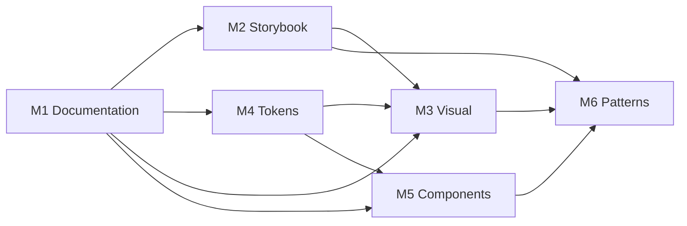

# Alejandria UI Kit — Design System Roadmap

**Generated:** 2026-07-03  
**Based on:**

- [`design-system-inventory.md`](./design-system-inventory.md)
- [`design-system-coverage.md`](./design-system-coverage.md)
- [`visual-audit.md`](./visual-audit.md)
- [`pattern-audit.md`](./pattern-audit.md)

**Package baseline:** `@alejandria/ui-kit@0.1.0`  
**Scope:** Prioritized work plan derived from audit findings. No code changes included in this document.

---

## 1. Executive summary

The audits evaluated **142 inventory items** across PDF, Storybook, code, and knowledge docs. Current state:

| Area | Health | Key gap |
|------|--------|---------|
| Components (17 exported) | Strong | 11 partial vs PDF; 10 PDF-only concepts unbuilt |
| Component knowledge docs | Strong | 17/17 present (`status: draft`) |
| Tokens, patterns, guidelines | Weak | `knowledge/tokens/`, `patterns/`, `guidelines/` empty |
| Storybook coverage | Good | Composed demo-app patterns missing; chart stories nested |
| Visual PDF fidelity | Weak | 0 components rated High; dual palette (PDF gray vs teal) |
| Reusable patterns | Undocumented | 19 patterns identified; 0 in `knowledge/patterns/` |

### Recommended sequencing

Work is grouped into **6 milestones** following strict priority order:

1. **Documentation** — unlock team alignment before code churn  
2. **Missing Storybook stories** — make gaps visible and testable  
3. **Visual inconsistencies** — align implementation with PDF where intended  
4. **Missing design tokens** — formalize palette and remove hardcoded drift  
5. **Missing components** — net-new UI for PDF screens  
6. **Missing patterns** — extract and ship composable layouts  

### Effort legend

| Effort | Typical scope |
|--------|----------------|
| **Small** | Docs-only, single-file CSS fix, one story file, export wiring |
| **Medium** | Multi-file component work, new story compositions, token migration for one domain |
| **Large** | New screen/component family, Kanban/Ficha/Modal systems, full palette refactor |

### Impact legend

| Impact | Criteria |
|--------|----------|
| **High** | PDF-critical, flagship demos, blocks adoption, or affects many components |
| **Medium** | Improves fidelity or DX for a subset of the kit |
| **Low** | Polish, dev tooling, or edge cases |

---

## 2. Milestone overview

| Milestone | Theme | Items | Est. aggregate effort |
|-----------|-------|------:|----------------------|
| **M1** | Documentation foundation | 14 | Medium |
| **M2** | Storybook completeness | 12 | Medium–Large |
| **M3** | Visual PDF alignment | 14 | Large |
| **M4** | Design token system | 10 | Medium–Large |
| **M5** | Missing components | 10 | Large |
| **M6** | Pattern extraction & composition | 11 | Large |

---

## 3. Master backlog (prioritized)

Items are ordered **M1 → M6** within the table. Execute top-to-bottom within each milestone unless dependencies note otherwise.

| ID | Milestone | Work item | Impact | Effort | Sources |
|----|-----------|-----------|:------:|:------:|---------|
| M1-01 | Documentation | Publish **token reference** (`knowledge/tokens/`) — all 28 `--ds-*` vars + PDF hex aliases | High | Medium | Coverage §4.2, Inventory §4 |
| M1-02 | Documentation | Publish **pattern docs** P0: Operations Console, Full Operations Center, Module Grid, Task Board, Mission Panel | High | Medium | Pattern §6 |
| M1-03 | Documentation | Publish **pattern docs** P1: Navigation Rail, Map Hero, Metrics Row, Chart Gallery, Command Header | High | Medium | Pattern §6 |
| M1-04 | Documentation | Publish **pattern docs** P2: Filtering, Alerts, Operational Table, Event Feed, Resource Summary | Medium | Small | Pattern §6 |
| M1-05 | Documentation | Create **icon reference** — 4 tiers (180/50/20), 35 exports, usage in ModuleCard | High | Medium | Inventory §7, Coverage §3.7 |
| M1-06 | Documentation | Document **PDF vs implementation palette strategy** (dual palette, when to use each) | High | Small | Visual §Cross-cutting, Coverage §4.6 |
| M1-07 | Documentation | Add **guidelines** (`knowledge/guidelines/`) — icon policy (Alejandria SVG vs lucide-react), Storybook dark canvas | High | Small | Visual §Global, Pattern §2 |
| M1-08 | Documentation | Document **screens**: Operations Center, Módulos hub, Reporting dashboard, Kanban (as-is vs PDF) | Medium | Small | Coverage §3.10, Pattern §7 |
| M1-09 | Documentation | Document **layouts** (`ops-*` regions) and demo-app architecture | Medium | Medium | Coverage §3.9, Inventory §9 |
| M1-10 | Documentation | Update **README** — 17 components, chart family, icons not exported from root | Medium | Small | Inventory §2 |
| M1-11 | Documentation | Fix **component knowledge gaps**: MetricCard `tone` (no CSS), invalid `icon` in Overview story, chart nested SB paths | Medium | Small | Visual §MetricCard, §Overview |
| M1-12 | Documentation | Add **utilities** note (`cn`, `ds-spin`, font import) to guidelines or tokens doc | Low | Small | Coverage §3.11 |
| M1-13 | Documentation | Record **audit index** linking inventory, coverage, visual, pattern, roadmap | Medium | Small | — |
| M1-14 | Documentation | Promote component docs from `draft` → `stable` after M3 visual fixes land | Low | Small | Coverage §6 |
| M2-01 | Storybook | Add **dark canvas** theme / decorator for PDF-faithful previews | High | Small | Visual §Global |
| M2-02 | Storybook | Port **Full Operations Center** from `apps/web` → `Alejandria/Overview` or new `Screens/` | High | Large | Pattern §Full Operations Center |
| M2-03 | Storybook | Add **Navigation Rail** story (extract from demo or rebuild with kit) | High | Medium | Pattern §Navigation Rail |
| M2-04 | Storybook | Add **Map Hero + Floating Panel** story | High | Medium | Pattern §Map Hero |
| M2-05 | Storybook | Add **Event Feed** and **Resource Summary** stories | Medium | Small | Pattern §Event Feed, §Resource Summary |
| M2-06 | Storybook | Add **Módulos hub** full-page story (Module Grid + page chrome) | High | Small | Coverage §3.10, Pattern §Module Grid |
| M2-07 | Storybook | Add **Reporting dashboard** composed story (Metrics Row + Chart Gallery) | High | Medium | Pattern §7 gaps |
| M2-08 | Storybook | Add **Filter composition** story (Filter Pair + SegmentedControl + TextField) | Medium | Small | Pattern §Filter Pair |
| M2-09 | Storybook | Split **dedicated story files** for BarChartCard, DonutChartCard, LineChartCard | Medium | Small | Coverage §3.1, Inventory §2 |
| M2-10 | Storybook | Export **NotificacionesIcon** in `Icons/index.ts` + catalog | Medium | Small | Inventory §7.2 |
| M2-11 | Storybook | Add **screen stubs** for Login, Modal, Ficha (wireframe/markup-only stories) | Medium | Medium | Coverage §4.3 |
| M2-12 | Storybook | Align **Icon catalog** preview sizes with PDF tiers (180/50/20) | Low | Small | Visual §Icons |
| M3-01 | Visual | **Storybook preview.css** — dark background option matching PDF `#060606` / `#2a2927` | High | Small | Visual §Global |
| M3-02 | Visual | **ModuleCard** — padding `50px` top, title 24pt, metrics Montserrat 16pt, icon 180px | High | Small | Visual §ModuleCard |
| M3-03 | Visual | **TaskCard** — background `#2a2927`, border `#c1c1c1`, title 20pt, status 20pt, body 18pt `#8a8b87` | High | Medium | Visual §TaskCard |
| M3-04 | Visual | **MetricCard** — implement `ds-metric--{tone}` CSS; reporting value scale (~84pt); `#ff0404` critical | High | Medium | Visual §MetricCard |
| M3-05 | Visual | **Button** — PDF gray variant (`#494949` fill, white text, compact padding) or remap primary | High | Medium | Visual §Button |
| M3-06 | Visual | **TextField / SelectField** — input bg `#2a2927`, Source Code 20pt, border `#c1c1c1` | Medium | Medium | Visual §TextField |
| M3-07 | Visual | **ChartCard family** — PDF borders `#e6e6e6`, bar 15px/grid, line `#c1c1c1`, donut stroke 15–25pt, PDF colors | High | Large | Visual §Bar/Donut/Line |
| M3-08 | Visual | **Card** — ficha widget variant (Extralight 16pt title, optional no teal eyebrow) | Medium | Medium | Visual §Card |
| M3-09 | Visual | **Overview / OperationsConsole** — dark canvas, Alejandria icons, remove dead MetricCard `icon` props | High | Small | Visual §Overview |
| M3-10 | Visual | **Badge** — optional “inline status” mode matching PDF 20pt estado (vs chip) | Medium | Medium | Visual §Badge |
| M3-11 | Visual | Load **Montserrat Extralight (200)** + Source Code Light for PDF typography refs | Medium | Small | Visual §Global |
| M3-12 | Visual | Reconcile **focus/hover** — document teal vs PDF (or scope teal to non-PDF components) | Medium | Small | Visual §Cross-cutting |
| M3-13 | Visual | **AlertBanner** — optional flat strip variant per PDF MISCELÁNEAS | Low | Medium | Visual §AlertBanner |
| M3-14 | Visual | **Icons in stories** — replace lucide-react with Alejandria SVG where PDF specifies | Medium | Medium | Visual §Cross-cutting |
| M4-01 | Tokens | Add **PDF surface tokens**: `--ds-color-pdf-bg`, `--ds-color-pdf-surface`, `--ds-color-pdf-input` (`#060606`, `#2a2927`) | High | Small | Inventory §4.4, Coverage §4.1 |
| M4-02 | Tokens | Add **PDF neutral tokens**: `--ds-color-pdf-border`, `--ds-color-pdf-muted`, `--ds-color-pdf-button` (`#c1c1c1`, `#8a8b87`, `#494949`) | High | Small | Inventory §4.4 |
| M4-03 | Tokens | Add **PDF semantic chart tokens**: `--ds-color-pdf-danger`, `--ds-color-pdf-warning`, `--ds-color-pdf-success` (`#ff0404`, `#e3a500`, `#28a500`) | High | Small | Visual §Cross-cutting |
| M4-04 | Tokens | Add **PDF widget border** `--ds-color-pdf-widget-line` (`#e6e6e6`) | Medium | Small | Inventory §4.4 |
| M4-05 | Tokens | Migrate **hardcoded hex** in ModuleCard, ChartCard to tokens | High | Medium | Inventory §4.4, Coverage §4.6 |
| M4-06 | Tokens | Define **token tiers**: `pdf.*` vs `brand.*` (teal) namespaces in `styles.css` | High | Medium | Coverage §4.6 |
| M4-07 | Tokens | Document **token → component mapping** in `knowledge/tokens/` | High | Small | Depends M1-01 |
| M4-08 | Tokens | Add **typography scale tokens** (PDF pt sizes as rem/custom props) | Medium | Medium | Visual §TaskCard, §MetricCard |
| M4-09 | Tokens | Add **spacing tokens** for card padding (10/15/40/50px PDF values) | Medium | Small | Visual §ModuleCard, §Card |
| M4-10 | Tokens | Resolve **duplicate palette** — single source of truth decision (PDF-first vs teal-first per context) | High | Large | Coverage §4.6 |
| M5-01 | Components | **Modal** — dialog shell per PDF MODALES (greeting, actions, file attach) | High | Large | Inventory §14, Coverage §4.1 |
| M5-02 | Components | **NavigationRail / Menu** — vertical nav from PDF MENÚS (replace `ops-rail` ad-hoc) | High | Large | Coverage §4.1, Pattern §Navigation Rail |
| M5-03 | Components | **FichaLayout** — detail sheet scaffold (widgets, filters, metrics, 40px padding) | High | Large | Inventory §14 |
| M5-04 | Components | **LoginScreen** — usuario/contraseña, pattern circles, submit | Medium | Medium | Coverage §4.1 |
| M5-05 | Components | **InvestigationCard** — VUELO XR flight-style metric card (PDF p. 2) | Medium | Medium | Inventory §14 |
| M5-06 | Components | **FilterPanel** — composed filtros region (SelectField + SegmentedControl + labels) | Medium | Medium | Inventory §14 |
| M5-07 | Components | **EstadoSemáforo** — traffic-light status primitive | Low | Small | Inventory §14 |
| M5-08 | Components | **PatternLock** — login circle grid primitive | Low | Small | Coverage §4.1 |
| M5-09 | Components | **Export icons** from `packages/ui/src/index.ts` | Medium | Small | Inventory §2 |
| M5-10 | Components | **MetricCard `icon` slot** — implement or remove from stories/API | Medium | Small | Visual §Overview |
| M6-01 | Patterns | Extract **OperationsConsoleLayout** — header + metrics + split (reusable) | High | Medium | Pattern §Operations Console |
| M6-02 | Patterns | Extract **OperationsCenterLayout** — rail + map + board + side | High | Large | Pattern §Full Operations Center |
| M6-03 | Patterns | Extract **ModuleGridLayout** — responsive auto-fit grid wrapper | High | Small | Pattern §Module Grid |
| M6-04 | Patterns | Extract **MissionPanel** composition — Card + ProgressRing + stats slots | High | Medium | Pattern §Mission Panel |
| M6-05 | Patterns | Extract **MetricsRow** — 4-column responsive wrapper | Medium | Small | Pattern §Metrics Row |
| M6-06 | Patterns | Extract **TaskBoard** — section head + task grid | Medium | Medium | Pattern §Task Board |
| M6-07 | Patterns | Extract **ChartGallery** — 2×2 reporting grid | Medium | Small | Pattern §Chart Gallery |
| M6-08 | Patterns | Build **EventFeed** + **ResourceSummary** as composable list patterns | Medium | Medium | Pattern §Event Feed |
| M6-09 | Patterns | Build **KanbanBoard** — columns, drag semantics (PDF gap) | High | Large | Pattern §7, Inventory §14 |
| M6-10 | Patterns | Build **ReportingDashboard** — metrics + charts + filters single composition | High | Medium | Pattern §7 |
| M6-11 | Patterns | Consolidate **FilteringBar** — search + segmented + selects | Medium | Medium | Pattern §Filter Pair |

---

## 4. Milestone detail

### Milestone 1 — Documentation foundation

**Goal:** Establish knowledge base parity with code before visual or API changes.  
**Unlocks:** Consistent decisions for M3–M6; reduces duplicate palette confusion.

| Priority | Deliverable | Impact | Effort |
|:--------:|-------------|:------:|:------:|
| 1 | `knowledge/tokens/README.md` + per-category token tables | High | Medium |
| 2 | `knowledge/patterns/operations-console.md` | High | Small |
| 3 | `knowledge/patterns/operations-center.md` | High | Medium |
| 4 | `knowledge/patterns/module-grid.md` | High | Small |
| 5 | `knowledge/patterns/mission-panel.md` | High | Small |
| 6 | `knowledge/patterns/task-board.md` | High | Small |
| 7 | `knowledge/guidelines/icon-usage.md` | High | Small |
| 8 | `knowledge/guidelines/visual-source-of-truth.md` (PDF vs teal) | High | Small |
| 9 | `knowledge/icons/README.md` (catalog + tiers) | High | Medium |
| 10 | Screen + layout reference docs | Medium | Medium |

**Exit criteria:** `knowledge/tokens/`, `patterns/`, `guidelines/` no longer empty; P0 patterns documented; palette strategy written.

**Dependencies:** None — start here.

---

### Milestone 2 — Storybook completeness

**Goal:** Every composed pattern and demo-app region has a Storybook entry for review and regression.  
**Unlocks:** Visual fixes (M3) can be validated in isolation.

| Priority | Deliverable | Impact | Effort |
|:--------:|-------------|:------:|:------:|
| 1 | Dark canvas decorator / global theme toggle | High | Small |
| 2 | `Alejandria/Screens/OperationsCenter` (from `apps/web`) | High | Large |
| 3 | `Alejandria/Screens/ModuleHub` | High | Small |
| 4 | `Alejandria/Screens/ReportingDashboard` | High | Medium |
| 5 | `Alejandria/Layouts/NavigationRail` | High | Medium |
| 6 | `Alejandria/Layouts/MapHeroPanel` | High | Medium |
| 7 | `Alejandria/Patterns/EventFeed`, `ResourceSummary` | Medium | Small |
| 8 | `Alejandria/Patterns/FilterBar` | Medium | Small |
| 9 | Dedicated `BarChartCard.stories.tsx`, etc. | Medium | Small |
| 10 | NotificacionesIcon in catalog | Medium | Small |
| 11 | Wireframe stories: Login, Modal, Ficha | Medium | Medium |

**Exit criteria:** Demo-app patterns visible in Storybook; chart components discoverable at top level; dark preview available.

**Dependencies:** M1-07 (icon policy) helps M2-02/M2-14; M2-01 should precede M3 visual QA.

---

### Milestone 3 — Visual PDF alignment

**Goal:** Raise visual fidelity from 0 High / 15 Low toward PDF spec on PDF-mapped components.  
**Unlocks:** Token migration (M4) with clear targets; credible PDF compliance story.

| Priority | Work stream | Impact | Effort |
|:--------:|-------------|:------:|:------:|
| 1 | Global Storybook dark environment | High | Small |
| 2 | ModuleCard (closest to Medium — push to High) | High | Small |
| 3 | TaskCard + MetricCard (PDF TARJETAS / MÉTRICAS) | High | Medium |
| 4 | Button + TextField (actions / login) | High | Medium |
| 5 | Chart family (largest visual delta) | High | Large |
| 6 | Card ficha widget variant | Medium | Medium |
| 7 | Typography weights (Extralight, Light) | Medium | Small |
| 8 | Story icon swap (lucide → Alejandria) | Medium | Medium |
| 9 | Badge inline-status variant | Medium | Medium |
| 10 | AlertBanner strip variant | Low | Medium |

**Exit criteria:** ModuleCard, TaskCard, MetricCard, ChartCard rated **Medium+** in re-audit; Overview uses dark canvas.

**Dependencies:** M1-06 palette strategy; M2-01 dark canvas; M4 tokens optional but recommended before M3-02–M3-07.

---

### Milestone 4 — Design token system

**Goal:** Replace hardcoded PDF hex and dual-palette drift with named, documented tokens.  
**Unlocks:** Sustainable visual consistency; simpler M3 maintenance.

| Priority | Deliverable | Impact | Effort |
|:--------:|-------------|:------:|:------:|
| 1 | PDF palette CSS custom properties | High | Small |
| 2 | Namespace strategy (`--ds-pdf-*` vs `--ds-brand-*`) | High | Medium |
| 3 | Migrate ModuleCard + ChartCard hardcoded values | High | Medium |
| 4 | Typography + spacing tokens from PDF | Medium | Medium |
| 5 | Token reference docs (sync M1-01) | High | Small |
| 6 | Palette consolidation decision + migration plan | High | Large |

**Exit criteria:** No orphan `#060606` / `#8a8b87` without token; `knowledge/tokens/` complete.

**Dependencies:** M1-01, M1-06; ideally runs parallel with late M3.

---

### Milestone 5 — Missing components

**Goal:** Ship PDF-defined UI that has no package component today.  
**Unlocks:** M6 full patterns; screen stories become real.

| Priority | Component | Impact | Effort |
|:--------:|-----------|:------:|:------:|
| 1 | Modal | High | Large |
| 2 | NavigationRail / Menu | High | Large |
| 3 | FichaLayout | High | Large |
| 4 | FilterPanel | Medium | Medium |
| 5 | LoginScreen | Medium | Medium |
| 6 | InvestigationCard | Medium | Medium |
| 7 | Export icons from package index | Medium | Small |
| 8 | MetricCard icon API fix | Medium | Small |
| 9 | EstadoSemáforo | Low | Small |
| 10 | PatternLock | Low | Small |

**Exit criteria:** Coverage §4.1 “missing implementation” items addressed or explicitly deferred with docs.

**Dependencies:** M4 tokens for new components; M1 pattern docs for Ficha/Modal structure.

---

### Milestone 6 — Pattern extraction & composition

**Goal:** Promote inline story markup and `ops-*` CSS into documented, reusable pattern building blocks.  
**Unlocks:** Faster product screens; Storybook as true layout catalog.

| Priority | Pattern | Impact | Effort |
|:--------:|---------|:------:|:------:|
| 1 | OperationsCenterLayout | High | Large |
| 2 | OperationsConsoleLayout | High | Medium |
| 3 | KanbanBoard | High | Large |
| 4 | ReportingDashboard | High | Medium |
| 5 | MissionPanel | High | Medium |
| 6 | ModuleGridLayout | High | Small |
| 7 | TaskBoard + MetricsRow wrappers | Medium | Medium |
| 8 | EventFeed + ResourceSummary | Medium | Medium |
| 9 | ChartGalleryLayout | Medium | Small |
| 10 | FilteringBar | Medium | Medium |

**Exit criteria:** `knowledge/patterns/` matches shipped layout helpers; demo app consumes package patterns where feasible.

**Dependencies:** M5 components (NavRail, Ficha, Modal); M2 stories as acceptance tests.

---

## 5. Dependency graph

**Critical path:** M1 → M2 (dark canvas) → M4 (PDF tokens) → M3 (component visual fixes) → M5 (Modal, Nav, Ficha) → M6 (Operations Center pattern).

---

## 6. Quick wins (≤1 day each)

High impact, small effort — suitable for first sprint:

| ID | Item | Impact | Effort |
|----|------|:------:|:------:|
| M2-01 | Dark Storybook canvas decorator | High | Small |
| M2-10 | NotificacionesIcon export + catalog | Medium | Small |
| M3-02 | ModuleCard padding + title size fix | High | Small |
| M4-01 | Add 3 PDF surface tokens | High | Small |
| M1-06 | Palette strategy doc | High | Small |
| M1-02 | Operations Console pattern doc | High | Small |
| M2-09 | Dedicated chart story files | Medium | Small |
| M5-09 | Export icons from package index | Medium | Small |

---

## 7. Deferred / out of scope (document only)

Items identified in audits but recommended to **document and defer** until M1–M4 complete:

| Item | Reason to defer |
|------|-----------------|
| Full palette replacement (teal → PDF gray everywhere) | Large blast radius; needs M1-06 decision |
| Kanban drag-and-drop | Large; Task Board grid sufficient for MVP |
| Remove all lucide-react usage | Medium; needs icon policy (M1-07) first |
| Horizontal bar chart variant | Chart refactor (M3-07) first |
| Component doc `draft` → `stable` | After visual stabilization (M3) |

---

## 8. Success metrics (re-audit targets)

After roadmap execution, a follow-up audit should show:

| Metric | Current | Target |
|--------|--------:|-------:|
| Items with dedicated docs | 17 / 142 | ≥ 80 / 142 |
| Patterns in `knowledge/patterns/` | 0 | ≥ 8 |
| Components visual fidelity High | 0 | ≥ 4 |
| Components visual fidelity Low | 15 | ≤ 6 |
| Missing implementation (PDF) | 10 | ≤ 3 |
| Composed patterns in Storybook | 10 | ≥ 16 |
| PDF hardcoded hex without token | 7 | 0 |

---

## 9. Suggested release phases

| Phase | Milestones | Outcome |
|-------|------------|---------|
| **Phase A — Knowledge** | M1 complete | Team can build against documented patterns and tokens |
| **Phase B — Visibility** | M2 complete | Storybook shows full product compositions |
| **Phase C — Fidelity** | M3 + M4 complete | PDF-aligned visuals with formal tokens |
| **Phase D — Product UI** | M5 + M6 complete | PDF screens and layouts shippable from package |

---

## 10. Audit metadata

| Field | Value |
|-------|-------|
| Total backlog items | 71 |
| Milestones | 6 |
| Code modified | No |
| Estimation basis | Audit item counts + file-scope inference |

---

*End of roadmap. Derived from audit findings only; sequencing reflects stated priority order: Documentation → Storybook → Visual → Tokens → Components → Patterns.*
