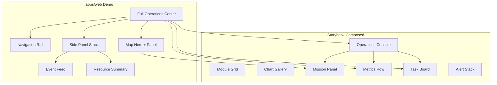

# Alejandria UI Kit — Pattern Audit

**Audit date:** 2026-07-03  
**Scope:** Composed Storybook stories, variant galleries with layout intent, and `apps/web` demo page  
**Sources:** `packages/ui/src/**/*.stories.tsx`, `apps/web/src/App.tsx`, `apps/web/src/app.css`  
**Related audits:** [`design-system-inventory.md`](./design-system-inventory.md), [`design-system-coverage.md`](./design-system-coverage.md), [`visual-audit.md`](./visual-audit.md)

---

## 1. Methodology

### Story classification

| Type | Definition | Pattern? |
|------|------------|:--------:|
| **Playground** | Single component with default `args`; no layout composition | No |
| **State / variant story** | One component, alternate props (Disabled, Invalid, Off) | No |
| **Variant gallery** | Repeated instances of one component to show tones, sizes, or variants in a grid/stack | Partial |
| **Composed story** | Two or more components (or app regions) arranged with explicit layout semantics | **Yes** |
| **Demo page** | Full-screen app shell outside Storybook (`apps/web`) | **Yes** |

### Pattern identification criteria

A **reusable UI pattern** is a named, repeatable arrangement of components with a recognizable purpose and layout structure. Patterns may be implemented inline in story `render` functions or in demo-app CSS — none are exported as package components today.

`knowledge/patterns/` is empty (`.gitkeep` only). All patterns below exist only as story or app markup.

---

## 2. Composed Storybook story inventory

| Storybook path | Story name | Type | Maps to pattern |
|----------------|------------|------|-----------------|
| `Alejandria/Overview` | OperationsConsole | Composed | Operations Console |
| `Alejandria/ModuleCard` | GridExample | Composed | Module Grid |
| `Alejandria/ChartCard` | Gallery | Composed | Chart Gallery |
| `Alejandria/Card` | WithActionsAndFooter | Composed | Mission Panel |
| `Alejandria/Card` | BodyOnly | Composed | Compact Panel |
| `Alejandria/AlertBanner` | Tones | Variant gallery | Alert Stack |
| `Alejandria/AlertBanner` | WithAction | Composed | Actionable Alert |
| `Alejandria/MetricCard` | Tones | Variant gallery | Metrics Row |
| `Alejandria/TaskCard` | Tones | Variant gallery | Task Board |
| `Alejandria/Button` | Variants | Variant gallery | Action Toolbar |
| `Alejandria/Button` | Sizes | Variant gallery | Action Toolbar |
| `Alejandria/Badge` | Tones | Variant gallery | Status Chip Row |
| `Alejandria/ProgressRing` | Tones / Sizes | Variant gallery | Progress Indicators |
| `Alejandria/SelectField` | CompactFilters | Composed | Filter Pair |
| `Alejandria/Switch` | Stack | Variant gallery | Settings Stack |
| `Alejandria/DataTable` | Playground / DenseOperationalRows | Composed (rows) | Operational Table |
| `Alejandria/Icons` | Catalog | Composed | Icon Catalog |
| `Alejandria/SegmentedControl` | Playground | Single (borderline) | Task Filter Bar |

### Playground-only stories (not patterns)

Single-component defaults with no multi-component layout:  
`AlertBanner/Playground`, `Badge/Playground`, `Button/Playground`, `Card/Playground`, `ChartCard/Base`, `ChartCard/BarChart`, `ChartCard/DonutChart`, `ChartCard/LineChart`, `DataTable/Playground`, `DataTable/WithoutCaption`, `MetricCard/Playground`, `ModuleCard/Investigaciones|Ciberseguridad|Evidencias|Género`, `ProgressRing/Playground`, `SegmentedControl/CriticalSelected|WithDisabledItem`, `SelectField/Playground|Disabled|Invalid`, `Switch/Playground|Off|Disabled`, `TaskCard/Playground`, `TextField/Playground|WithIcon|WithAction|Invalid`, `Button/Loading`, `Badge/WithoutDot`, `AlertBanner/Playground`.

---

## 3. Reusable UI patterns

---

### Operations Console

| Field | Detail |
|-------|--------|
| **Source** | `Alejandria/Overview` → `OperationsConsole` (`Components.stories.tsx`) |
| **Also appears in** | `apps/web` (expanded variant — see Full Operations Center) |

**Purpose**  
Single-screen operational dashboard combining KPIs, task workload, and a side mission panel for quick situational awareness and actions (filter, assign, search).

**Components used**  
`Badge`, `Button`, `MetricCard` (×4), `TaskCard` (×4), `Card`, `ProgressRing`, `TextField`  
External: `lucide-react` icons (Filter, ArrowRight, Crosshair, Search, AlertTriangle, Shield, RadioTower, Activity)

**Layout**  
Fullscreen CSS grid (`gap: 18`, `padding: 24`, `minHeight: 100vh`):

1. **Header row** — `flex`, space-between: left title block, right button group  
2. **Metrics row** — `grid`, 4 equal columns (`repeat(4, minmax(0, 1fr))`, `gap: 14`)  
3. **Main split** — `grid`, `1.3fr / 0.7fr`:  
   - Left: 2×2 `TaskCard` grid (`gap: 12`)  
   - Right: single `Card` with centered body stack

**Visual hierarchy**  
1. Page title (`h1` 2.4rem display) + danger `Badge` (“Alerta nueva”)  
2. Primary actions (Filtrar, Asignar) top-right  
3. Four KPI `MetricCard`s (equal weight)  
4. Task grid (dominant content width)  
5. Side `Card` (“Pronostico”) secondary

**Missing reusable pattern**  
No `OperationsConsole` layout component or `knowledge/patterns/` doc. Layout is inline styles. `MetricCard` `icon` prop is passed but not rendered by the component. No shared layout primitive between Storybook and `apps/web`.

**Candidate for documentation** | **Yes — High priority**  
Central reference demo; closest Storybook equivalent to PDF reporting/ficha composite; heavily reused concept across audits.

---

### Full Operations Center (Demo App)

| Field | Detail |
|-------|--------|
| **Source** | `apps/web/src/App.tsx` + `app.css` (`ops-*` classes) |
| **Storybook equivalent** | Partial — `OperationsConsole` (subset) |

**Purpose**  
Full mission-control application shell: persistent navigation, map-centric hero, KPI strip, task board, and contextual side panels (resources, event log).

**Components used**  
`Badge`, `Button`, `Card` (×3), `MetricCard` (×4), `ProgressRing`, `TaskCard` (×3), `TextField`  
App-only: `ops-rail` nav, map image, timer, markers, feed list, resource list  
External: `lucide-react` (15+ icons)

**Layout**  
`ops-app`: `88px` sidebar + fluid main (`grid-template-columns: 88px minmax(0, 1fr)`)

Main column (`ops-main`), top to bottom:

1. `ops-command` — title + search/filters/actions (`grid`, title | tools)  
2. `ops-map` — full-width map hero with floating `Card` panel  
3. `ops-metrics` — 4-column `MetricCard` row  
4. `ops-lower` — `1fr / 390px` split: task board | side stack

**Visual hierarchy**  
1. Map hero (largest visual area) with mission `Card` overlay  
2. Command header (alert badge + h1 + tools)  
3. KPI metrics row  
4. Task board (section head + grid)  
5. Side cards (resources, events) — tertiary

**Missing reusable pattern**  
Entire `ops-*` layout system lives in `apps/web` only — not in Storybook or package. No pattern doc. Navigation rail, map section, event feed, and resource list are ad-hoc CSS.

**Candidate for documentation** | **Yes — High priority**  
Richest end-to-end composition in the repo; superset of Operations Console; maps to PDF ficha/reporting screens.

---

### Command Header

| Field | Detail |
|-------|--------|
| **Source** | `OperationsConsole` header; `apps/web` `ops-command` |

**Purpose**  
Page-level context strip: alert state, mission title, optional subtitle, and primary operator tools (search, filter, assign).

**Components used**  
`Badge` (danger, dot), native `h1` / `p`, `TextField`, `Button` (secondary + primary), `lucide-react` icons

**Layout**  
Horizontal flex or grid: title block left; tools right (`TextField` + 2× `Button` in demo app).

**Visual hierarchy**  
1. Alert `Badge` (highest urgency)  
2. Page `h1`  
3. Subtitle / mission context (`p` in demo only)  
4. Tool cluster (search → filter → primary action)

**Missing reusable pattern**  
Not extracted; duplicated between Overview story and `App.tsx` with different copy and slightly different tool sets.

**Candidate for documentation** | **Yes — Medium priority**  
Reusable across dashboards; should be documented as a composition recipe, not a component.

---

### Metrics Row

| Field | Detail |
|-------|--------|
| **Source** | `MetricCard/Tones`; `OperationsConsole` row 2; `apps/web` `ops-metrics` |

**Purpose**  
Horizontal KPI strip for at-a-glance operational health (risk, units, alerts, nodes).

**Components used**  
`MetricCard` (×4 typical)

**Layout**  
`grid-template-columns: repeat(4, minmax(0, 1fr))`, `gap: 14` (Storybook) or `ops-metrics` CSS (demo).  
`MetricCard/Tones` uses `repeat(4, minmax(180px, 1fr))`.

**Visual hierarchy**  
Equal-weight columns; label → large value → change text per card. No card is visually dominant unless `tone` styling is added (currently ineffective — see visual audit).

**Missing reusable pattern**  
No `MetricsRow` wrapper; responsive collapse defined only in `app.css` media queries (demo), not in Storybook.

**Candidate for documentation** | **Yes — Medium priority**  
Matches PDF MÉTRICAS reporting strip; simple, high-reuse pattern.

---

### Task Board

| Field | Detail |
|-------|--------|
| **Source** | `TaskCard/Tones`; `OperationsConsole` 2×2 grid; `apps/web` `ops-board` + `ops-task-grid` |

**Purpose**  
Grid of operational task cards for scanning status, progress, and metadata across active work items.

**Components used**  
`TaskCard` (×3–4)  
Demo adds: `Badge`, `Button`, `h2` section head (`ops-section-head`)

**Layout**  
- Storybook Overview: `repeat(2, minmax(0, 1fr))`, `gap: 12`  
- `TaskCard/Tones`: same 2×2 grid  
- Demo: `ops-task-grid` — `repeat(3, minmax(0, 1fr))`, `gap: 14`

**Visual hierarchy**  
Demo: section `Badge` + `h2` “Tareas en curso” → ghost “Ver todas” → task cards. Storybook: cards only, no section chrome.

**Missing reusable pattern**  
No section header component; no Kanban columns (PDF describes Kanban — not implemented). Grid column count varies (2 vs 3) without documented guidance.

**Candidate for documentation** | **Yes — High priority**  
Core PDF TARJETAS pattern; differs from Kanban — gap should be documented explicitly.

---

### Module Grid

| Field | Detail |
|-------|--------|
| **Source** | `Alejandria/ModuleCard` → `GridExample` |

**Purpose**  
Module launcher hub: browse platform modules with icon, title, and key metrics per module.

**Components used**  
`ModuleCard` (×7), Alejandria module SVG icons via ``

**Layout**  
`display: grid`, `gap: 20`, `grid-template-columns: repeat(auto-fit, minmax(260px, 1fr))`, full width.

**Visual hierarchy**  
Uniform cards in responsive auto-fit grid; no featured module or grouping. Each card: icon (top) → title → divider → metric pairs.

**Missing reusable pattern**  
Not in Overview or demo app. No page-level wrapper or heading. Individual module stories (`Investigaciones`, etc.) are single-card demos, not a pattern.

**Candidate for documentation** | **Yes — High priority**  
Direct match to PDF MÓDULOS hub; only Storybook composition for module navigation.

---

### Chart Gallery

| Field | Detail |
|-------|--------|
| **Source** | `Alejandria/ChartCard` → `Gallery` |

**Purpose**  
Reporting wall showing multiple chart types side by side for comparative analytics (zones, tasks, alerts, resources).

**Components used**  
`BarChartCard` (×2), `DonutChartCard`, `LineChartCard` (all via `ChartCard` shell)

**Layout**  
`grid`, `gap: 14`, `grid-template-columns: repeat(2, minmax(280px, 1fr))` — 2×2 gallery.

**Visual hierarchy**  
Equal-weight chart cards; title and footer per card. No dominant chart or dashboard section title.

**Missing reusable pattern**  
No reporting dashboard wrapper; individual chart stories (`BarChart`, `DonutChart`, `LineChart`) are single-chart views. Not used in `apps/web` or Overview.

**Candidate for documentation** | **Yes — Medium priority**  
Maps to PDF GRÁFICOS reporting layouts.

---

### Mission Panel

| Field | Detail |
|-------|--------|
| **Source** | `Card/WithActionsAndFooter`; `OperationsConsole` side `Card`; `apps/web` `ops-map__panel` |

**Purpose**  
Focused mission summary: progress, key figures, and quick actions inside a `Card` shell — used on map overlay or as sidebar panel.

**Components used**  
`Card`, `ProgressRing`, `Badge`, `Button`  
Variants add: inline stat blocks (`strong` + `span`), `TextField`, `lucide-react` icons (Eye, Crosshair)

**Layout**  
- **WithActionsAndFooter:** body `grid` `auto 1fr` — ring left, stats right; header with actions; footer badge + button  
- **Overview side card:** body centered stack — ring above `TextField`  
- **Map panel:** `ops-map__panel-grid` — ring + dual stat pairs

**Visual hierarchy**  
1. Card eyebrow (“Mision”)  
2. Title + description in header  
3. `ProgressRing` (visual anchor in body)  
4. Numeric stats or search field  
5. Footer: status `Badge` + secondary action

**Missing reusable pattern**  
Three variants with different body layouts; no shared `MissionPanel` composition or documented slots. Inline typography in `WithActionsAndFooter` bypasses `MetricCard`.

**Candidate for documentation** | **Yes — High priority**  
Maps to PDF ficha widgets; high reuse potential across map and sidebar contexts.

---

### Compact Panel

| Field | Detail |
|-------|--------|
| **Source** | `Card/BodyOnly` |

**Purpose**  
Minimal card container for arbitrary compact content without header/footer chrome.

**Components used**  
`Card` only (empty shell with body slot)

**Layout**  
Single card; mono placeholder text in story.

**Visual hierarchy**  
Content-only; no heading structure.

**Missing reusable pattern**  
Trivial wrapper; value is documenting when to omit header/footer vs full `Card`.

**Candidate for documentation** | **Low priority**  
Useful as Card usage note inside Card docs, not standalone pattern file.

---

### Alert Stack

| Field | Detail |
|-------|--------|
| **Source** | `AlertBanner/Tones` |

**Purpose**  
Vertical list of alert severities for reviewing multiple concurrent operational signals.

**Components used**  
`AlertBanner` (×4), `lucide-react` icons per tone

**Layout**  
`display: grid`, `gap: 12`, single column.

**Visual hierarchy**  
Top-to-bottom by severity demo order (info → success → warning → danger); equal width banners.

**Missing reusable pattern**  
No stacking limit, dismiss, or grouping. Not composed with page header (unlike demo alert badge).

**Candidate for documentation** | **Yes — Medium priority**  
Supports PDF MISCELÁNEAS alertas concept.

---

### Actionable Alert

| Field | Detail |
|-------|--------|
| **Source** | `AlertBanner/WithAction` |

**Purpose**  
Critical alert with inline resolution action for operator response workflows.

**Components used**  
`AlertBanner`, `Button` (sm, danger), `lucide-react` AlertTriangle

**Layout**  
Single `AlertBanner` with `action` slot populated; 3-column internal grid (icon | content | action).

**Visual hierarchy**  
1. Danger tone + icon  
2. Title  
3. Description  
4. Primary destructive action (right-aligned)

**Missing reusable pattern**  
Only one example; not shown combined with Alert Stack or command header.

**Candidate for documentation** | **Yes — Medium priority**  
Document as AlertBanner composition recipe.

---

### Filter Pair

| Field | Detail |
|-------|--------|
| **Source** | `SelectField/CompactFilters` |

**Purpose**  
Side-by-side scope filters (region + status) for narrowing operational lists.

**Components used**  
`SelectField` (×2)

**Layout**  
`grid`, `gap: 14`, `repeat(2, minmax(0, 1fr))`.

**Visual hierarchy**  
Equal-weight filters; labels “Region” and “Estado”.

**Missing reusable pattern**  
Not wired to `Task Board`, `DataTable`, or `SegmentedControl`. No `FilterBar` combining selects + segmented + search (demo uses search in header separately).

**Candidate for documentation** | **Yes — Medium priority**  
Partial PDF filtros pattern; incomplete without SegmentedControl and TextField.

---

### Task Filter Bar

| Field | Detail |
|-------|--------|
| **Source** | `SegmentedControl/Playground` (and variants) |

**Purpose**  
Segmented task-scope filter (Todas, Hoy, Cerradas, Críticas) with optional icons.

**Components used**  
`SegmentedControl`, `lucide-react` icons per segment

**Layout**  
Single horizontal control; `minWidth: 520` decorator.

**Visual hierarchy**  
Selected segment highlighted (teal); icons + labels per item.

**Missing reusable pattern**  
Not composed with task list or data table in any story. Standalone control only.

**Candidate for documentation** | **Yes — Medium priority**  
Combine with Filter Pair and Command Header in a “Filtering” pattern doc.

---

### Action Toolbar

| Field | Detail |
|-------|--------|
| **Source** | `Button/Variants`, `Button/Sizes` |

**Purpose**  
Reference for primary, secondary, ghost, and danger actions at multiple sizes — used in headers and card footers.

**Components used**  
`Button` (×4 variants or ×3 sizes), `lucide-react` icons in some

**Layout**  
Horizontal `flex`, `gap: 12`, wrap.

**Visual hierarchy**  
Variants story: primary first. Sizes: sm → md → lg left to right.

**Missing reusable pattern**  
Not a page pattern; documents button grouping convention only.

**Candidate for documentation** | **Low priority**  
Cover inside Button knowledge doc / composition section.

---

### Status Chip Row

| Field | Detail |
|-------|--------|
| **Source** | `Badge/Tones` |

**Purpose**  
Reference row of semantic status chips for labeling zones, lots, simulation mode, etc.

**Components used**  
`Badge` (×5 tones), dot variant

**Layout**  
Horizontal `flex`, `gap: 10`, wrap.

**Visual hierarchy**  
Flat row; no grouping by severity.

**Missing reusable pattern**  
Chips used inside footers and tables elsewhere but not as a documented “status legend” pattern.

**Candidate for documentation** | **Low priority**  
Badge doc composition examples sufficient.

---

### Progress Indicators

| Field | Detail |
|-------|--------|
| **Source** | `ProgressRing/Tones`, `ProgressRing/Sizes` |

**Purpose**  
Compare ring tones and sizes for mission progress display.

**Components used**  
`ProgressRing` (×4 tones or ×3 sizes)

**Layout**  
Horizontal `flex`, `gap: 20`, centered.

**Visual hierarchy**  
Equal rings; tone/size is the variable.

**Missing reusable pattern**  
Gallery only; real usage is inside Mission Panel.

**Candidate for documentation** | **Low priority**  
Subset of Mission Panel documentation.

---

### Operational Table

| Field | Detail |
|-------|--------|
| **Source** | `DataTable/Playground`, `DataTable/DenseOperationalRows` |

**Purpose**  
Tabular listing of tasks or resources with badge-encoded status in cells.

**Components used**  
`DataTable`, `Badge` (embedded in row cells)

**Layout**  
Single full-width table in padded decorator (`minWidth: 720`). Dense variant: 4 columns, 3 resource rows.

**Visual hierarchy**  
Caption → header row → data rows. Status column right-aligned with `Badge` chips.

**Missing reusable pattern**  
Not combined with Filter Pair, section head, or pagination. Differs from Event Feed (list pattern in demo).

**Candidate for documentation** | **Yes — Medium priority**  
Useful for resource/task listing screens; no PDF table but fits operational UX.

---

### Settings Stack

| Field | Detail |
|-------|--------|
| **Source** | `Switch/Stack` |

**Purpose**  
Vertical list of boolean settings with labels and descriptions (alerts, silent mode, edit lock).

**Components used**  
`Switch` (×3)

**Layout**  
`display: grid`, `gap: 16`, single column.

**Visual hierarchy**  
Label → description → toggle per row; equal spacing.

**Missing reusable pattern**  
No PDF equivalent; not used in demo app or Overview.

**Candidate for documentation** | **Low priority**  
Standard form pattern; Switch doc may suffice.

---

### Icon Catalog

| Field | Detail |
|-------|--------|
| **Source** | `Alejandria/Icons` → `Catalog` |

**Purpose**  
Searchable, grouped browser for Alejandria SVG icons across Cards, Investigations, Menu, and Modules tiers.

**Components used**  
App-only UI: search `input`, accordion sections, copy-to-clipboard cards  
Assets: 35 icons from `Icons/index.ts`

**Layout**  
Page header → search → accordion sections → responsive icon grid (`repeat(auto-fit, minmax(120px, 1fr))`).

**Visual hierarchy**  
1. “Icon Catalog” title  
2. Search + count  
3. Category accordions (Cards, Investigations, Menu, Modules)  
4. Icon tiles (name + category)

**Missing reusable pattern**  
Designer/dev tool, not product UI. Not in `knowledge/patterns/`. Notificaciones icon missing from catalog.

**Candidate for documentation** | **Yes — Low priority (internal/dev)**  
Document as Storybook utility pattern, not end-user UI.

---

### Navigation Rail (Demo only)

| Field | Detail |
|-------|--------|
| **Source** | `apps/web` `ops-rail`, `ops-nav`, `ops-brand` |

**Purpose**  
Persistent vertical navigation for mission areas (Mision, Tareas, Mapa, Datos, Docs) plus alert and security shortcuts.

**Components used**  
App-only `<button class="ops-nav__item">` + `lucide-react` icons  
Not from `@alejandria/ui-kit`

**Layout**  
`88px` sticky sidebar; `grid-template-rows: auto 1fr auto` — brand, nav, footer.

**Visual hierarchy**  
1. Brand mark + signal dot  
2. Primary nav (5 items)  
3. Footer: Alertas, Seguro

**Missing reusable pattern**  
Not in Storybook. Not a package component. Maps conceptually to PDF MENÚS.

**Candidate for documentation** | **Yes — High priority**  
Major shell pattern; gap between PDF and implementation.

---

### Map Hero with Floating Panel (Demo only)

| Field | Detail |
|-------|--------|
| **Source** | `apps/web` `ops-map`, `ops-map__panel` |

**Purpose**  
Map-first situational view with zone badge, mission timer, markers, and floating mission `Card`.

**Components used**  
`Badge`, `Card`, `ProgressRing`, `Button`, map image, app-only timer/markers/scan overlay

**Layout**  
Relative map container; absolute/floating top line (badge + timer); `Card` positioned as `ops-map__panel`; decorative markers.

**Visual hierarchy**  
1. Map (full bleed)  
2. Floating mission `Card`  
3. Topline badge + timer  
4. Markers (decorative)

**Missing reusable pattern**  
Entirely app-specific CSS; Mission Panel pattern overlaps but map context is undocumented.

**Candidate for documentation** | **Yes — High priority**  
Maps to PDF ficha sobre mapa (70% opacity context).

---

### Side Panel Stack (Demo only)

| Field | Detail |
|-------|--------|
| **Source** | `apps/web` `ops-side` |

**Purpose**  
Secondary column combining resource summary and live event log below the task board.

**Components used**  
`Card` (×2), `Badge`, `Button`, app-only `ops-resource-list`, `ops-feed`

**Layout**  
`ops-side`: vertical `grid`, `gap: 16` — two stacked cards.

**Visual hierarchy**  
1. Resources card (metrics list + footer action)  
2. Events card (feed list)

**Missing reusable pattern**  
Resource list and feed are raw divs, not components. Not in Storybook.

**Candidate for documentation** | **Yes — Medium priority**  
Split into Resource Summary and Event Feed sub-patterns.

---

### Event Feed (Demo only)

| Field | Detail |
|-------|--------|
| **Source** | `apps/web` `ops-feed` inside `Card` “Eventos” |

**Purpose**  
Chronological log of operational events with type badge, description, and day tag.

**Components used**  
`Card`, `Badge`, app-only `ops-feed__item` rows

**Layout**  
Vertical list inside card body; each row: `grid` `auto minmax(0, 1fr) auto`.

**Visual hierarchy**  
Badge (event type) → text → day tag (`strong` right)

**Missing reusable pattern**  
No `EventFeed` or `FeedItem` component; not in Storybook.

**Candidate for documentation** | **Yes — Medium priority**  
Reusable log pattern for ops consoles.

---

### Resource Summary (Demo only)

| Field | Detail |
|-------|--------|
| **Source** | `apps/web` `ops-resource-list` inside `Card` “Recursos” |

**Purpose**  
Compact three-metric summary (coverage, available units, blocks) with recalculate action.

**Components used**  
`Card`, `Badge`, `Button`, app-only 3-column stat grid

**Layout**  
`grid`, `repeat(3, 1fr)` — label + `strong` value per cell.

**Visual hierarchy**  
Card header → 3 equal metrics → footer badge + button.

**Missing reusable pattern**  
Could be `MetricCard` row but uses custom markup instead.

**Candidate for documentation** | **Yes — Medium priority**  
Document relationship to Metrics Row (overlap/duplication).

---

## 4. Pattern relationship map

---

## 5. Pattern coverage summary

| Pattern | Storybook | Demo app | Package component | `knowledge/patterns/` |
|---------|:---------:|:--------:|:-----------------:|:---------------------:|
| Operations Console | Yes | Partial | No | No |
| Full Operations Center | No | Yes | No | No |
| Command Header | Yes | Yes | No | No |
| Metrics Row | Yes | Yes | No | No |
| Task Board | Yes | Yes | No | No |
| Module Grid | Yes | No | No | No |
| Chart Gallery | Yes | No | No | No |
| Mission Panel | Yes | Yes | No | No |
| Alert Stack | Yes | No | No | No |
| Actionable Alert | Yes | No | No | No |
| Filter Pair | Yes | No | No | No |
| Task Filter Bar | Partial | No | No | No |
| Operational Table | Yes | No | No | No |
| Icon Catalog | Yes | No | No | No |
| Navigation Rail | No | Yes | No | No |
| Map Hero + Panel | No | Yes | No | No |
| Event Feed | No | Yes | No | No |
| Resource Summary | No | Yes | No | No |
| Settings Stack | Yes | No | No | No |

**Count:** 19 named patterns identified; **0** documented in `knowledge/patterns/`; **0** exported as layout components.

---

## 6. Documentation candidates (prioritized)

| Priority | Pattern | Rationale |
|:--------:|---------|-----------|
| **P0** | Full Operations Center | Richest composition; integrates most components; demo entry point |
| **P0** | Operations Console | Storybook flagship; only fullscreen overview |
| **P0** | Module Grid | Only module hub; direct PDF MÓDULOS mapping |
| **P0** | Task Board | Core PDF TARJETAS; clarify vs Kanban gap |
| **P0** | Mission Panel | Reused in 3 contexts; ficha widget analog |
| **P1** | Navigation Rail | Major shell; PDF MENÚS gap |
| **P1** | Map Hero + Floating Panel | PDF map context; not in Storybook |
| **P1** | Metrics Row | Simple, high reuse |
| **P1** | Chart Gallery | PDF GRÁFICOS reporting |
| **P1** | Command Header | Duplicated across Overview and demo |
| **P2** | Filter Pair + Task Filter Bar | Merge into “Filtering” pattern |
| **P2** | Alert Stack + Actionable Alert | Merge into “Alerts” pattern |
| **P2** | Operational Table | Resource/task listings |
| **P2** | Event Feed + Resource Summary | Side panel sub-patterns |
| **P3** | Icon Catalog | Dev-facing Storybook utility |
| **P3** | Action Toolbar, Status Chip Row, Progress Indicators, Settings Stack, Compact Panel | Covered by component docs |

### Suggested `knowledge/patterns/` files

| File | Patterns to include |
|------|---------------------|
| `operations-console.md` | Operations Console, Command Header, Metrics Row, Task Board, Mission Panel |
| `operations-center.md` | Full Operations Center, Navigation Rail, Map Hero, Side Panel Stack |
| `module-grid.md` | Module Grid |
| `chart-gallery.md` | Chart Gallery |
| `filtering.md` | Filter Pair, Task Filter Bar, Command Header search |
| `alerts.md` | Alert Stack, Actionable Alert |
| `operational-table.md` | Operational Table |
| `event-feed.md` | Event Feed, Resource Summary |

---

## 7. Notable gaps (patterns referenced but not implemented)

| Expected pattern (PDF / inventory) | Current state |
|----------------------------------|---------------|
| Kanban board | Task Board grid only; no columns/drag |
| Ficha (detail sheet) | Mission Panel fragments only |
| Módulos hub screen | Module Grid story only; no full page |
| Reporting dashboard | Chart Gallery + Metrics Row exist separately; not one composed story |
| Login screen | No story or pattern |
| Modal / asistente | No story or pattern |
| Filter panel (standalone) | Filter Pair + SegmentedControl not composed together |

---

## 8. Audit metadata

| Field | Value |
|-------|-------|
| Story files analyzed | 17 |
| Composed stories | 18 exports with multi-component layout |
| Playground-only stories | ~35 |
| Demo app patterns | 6 exclusive to `apps/web` |
| Code modified | No |

---

*End of pattern audit. Descriptive only — no code changes or recommendations beyond documentation candidacy.*
